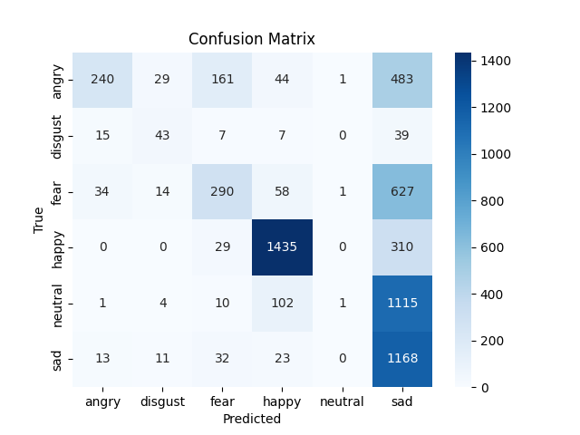

# EmotionTrak

## Description
This tool is able to detect a face from a pre-selected area on the screen, and identify which are top 5 dominant emotions the facial expressions might express.

  

### Methodology
To perform such a task, we use a zero-shot classification model. These types of models are quite reliable and accurate for classification purposes.   
     
Classification tasks were mainly of texts, but now there are models that are accurate enough to also classify images or visual content. The main advantage of using zero-shot classification models is the ability to choose the labels and costumize the target classification labels we wish, so we are not limited by some predified unchangable categories set by a specific model. What we have done is to use the OpenAI Clip models, and classify each frame into one of several different categories or labels. 
    
For our purpose, the categories or labels are emotions, and we will also add the word "Face" to them to be more specific for the model.   
    
We have selected several emotions for the labels such as:    
Happy Face, Sad Face, Angry Face, Fear Face, Nervous Face, Disgust Face, Contempt Face, Curious Face, Flirtatious Face, Ashamed Face, Bored Face, Confused Face, Proud Face, Guilty Face, Shy Face , Sympathetic Face, Infatuated Face, Neutral Face.    
    
Other unselected emotions were dropped from the list because they had too high correlations with other labels or emotions.   

    
Now, once we have selected an area of our screen to focus on, the algorithm will search for a face in it.    
If it detects a face by using another model designed for face recognition (OpenCV's haarcascades), it will crop the face and transform it into black and white to avoid biases, and feed it to the clip model, and start providing different probabilities for each label or emotion.   
Emotions with a higher probability for the face will appear first, and in total, the 5 most dominant emotions embodied through the face will appear.   

  

### Validation
particularly, we tested OpenAI Clip ViT-L/14, which is considered large.   

For more information, please visit:    
https://openai.com/research/clip    
https://github.com/openai/CLIP

Please take a glance into FER2013 evaluation performances for example.   
    
Besides the published results of the model in the context of the FER2013 database containing images of facial expressions for only 6 emotions, which is limiting the number of emotions we can validate, we tested the predictive ability of the model on this set. I Attached a Confusion Matrix here for drawing your own conclusions. In any case, it is very difficult to evaluate the capabilities of the model in respect to facial expressions. There are distinct emotions out of the six that the model clearly identifies as discrete emotions. Contrary to this widespread view of emotions as discrete categories, facial expressions should be considered as an expression of a range of emotions or on a continuum that can range between several emotions. for humans, this is harder to recognize when looking at faces and their expresssion, a thing that a computer might be better at. This fact can explain why the model conclude for example that a facial expression might represents anger, but in practice it was denoted by humans as sadness - it is possible that the person is both sad and angry at the same time. As the amount of labels or emotions increases, and there is more emotional richness or options to choose from, there is a better chance that several emotions will be recognized simultaneously from the facial expression. Therefore, it is necessary to check which emotions receive the largest percentages of prediction in the output of the model results.

  

    
## Requirements
Please make sure to have a GPU powerful enough for such task. this was only tested on Geforce RTX 4070 Mobile with 8GB memory.
If the proccess or interface is too slow, try to change to a different model.   
    
$ pip install torch torchvision torchaudio --extra-index-url https://download.pytorch.org/whl/cu113   
$ pip install git+https://github.com/openai/CLIP.git   
$ pip install -r requirements.txt   

