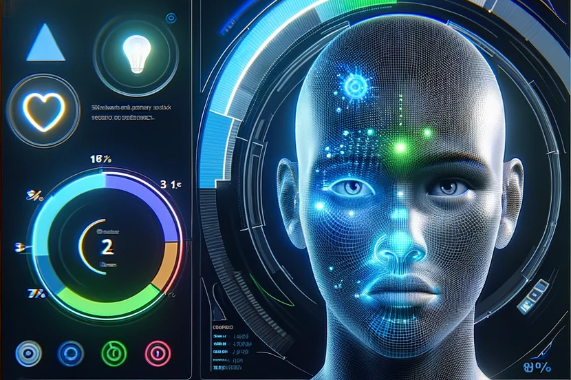

# EmotionTrak

## Description
This tool is able to detect a face from a pre-selected area on the screen, and identify which are top 5 dominant emotions the facial expressions might express.

  

### Methodology
To perform such a task, we use a zero-shot classification model. These types of models are quite reliable and accurate for classification purposes.   
     
Classification tasks were mainly of texts, but now there are models that are accurate enough to also classify images or visual content. What we have done is to use the OpenAI Clip models, and classify each frame into one of several different categories or labels. particlirly, we use OpenAI Clip ViT-L/14, which is considered large.   

For more information, please visit:    
https://openai.com/research/clip    
https://github.com/openai/CLIP

Please take a glance into FER2013 evaluation performances for example.   
    
   
For our purpose, the categories or labels are emotions, and we will also add the word "Face" to them to be more specific for the model.   
    
We have selected several emotions for the labels such as:    
Happy Face, Sad Face, Angry Face, Fear Face, Nervous Face, Disgust Face, Contempt Face, Curious Face, Flirtatious Face, Ashamed Face, Bored Face, Confused Face, Proud Face, Guilty Face, Shy Face , Sympathetic Face, Infatuated Face, Neutral Face.    
    
Other unselected emotions were dropped from the list because they had too high correlations with other labels or emotions.   

    
Now, once we have selected an area of our screen to focus on, the algorithm will search for a face in it.    
If it detects a face by using another model designed for face recognition (OpenCV's haarcascades), it will crop the face and transform it into black and white to avoid biases, and feed it to the clip model, and start providing different probabilities for each label or emotion.   
Emotions with a higher probability for the face will appear first, and in total, the 5 most dominant emotions embodied through the face will appear.   

  

## Requirements
* Please make sure to have a GPU powerful enough for such task. this was only tested on Geforce RTX 4070 Mobile with 8GB memory.
    
$ pip install torch torchvision torchaudio --extra-index-url https://download.pytorch.org/whl/cu113   
$ pip install git+https://github.com/openai/CLIP.git   
$ pip install -r requirements.txt   

